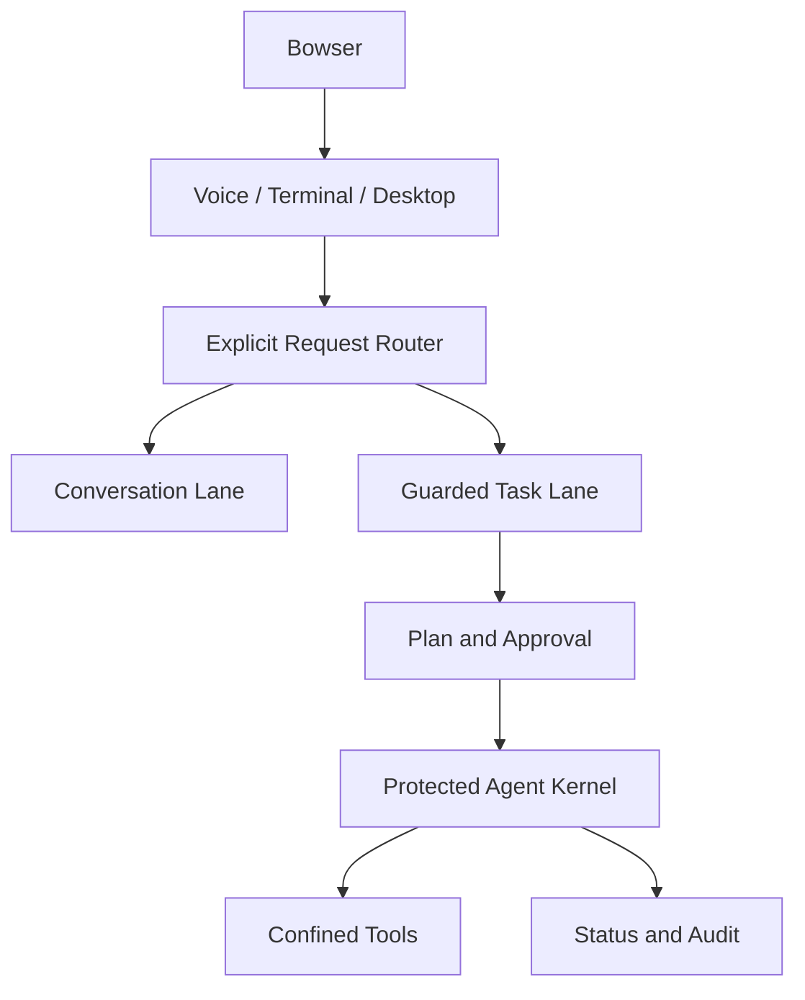

# Public Architecture Overview

## Trust boundary

Normal conversation cannot silently execute a system task. Guarded work must enter an explicit task lane, produce a reviewable plan, and receive approval. Protected operations require an additional action-specific authorization.

The user interfaces observe and submit requests; execution authority stays inside the protected runtime. Advisory AI peers can review or advise but do not inherit system authority.

## Device continuity

Archimedes is designed as one identity with one active device at a time. A guarded handoff releases the current device and authorizes a named target with a short-lived, one-time token. The public description deliberately omits implementation details that would weaken the security boundary.
